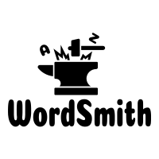
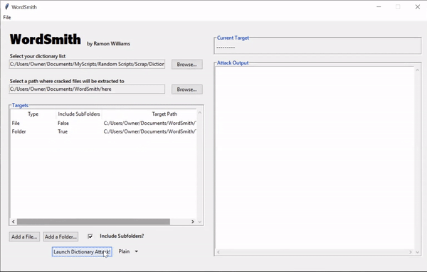
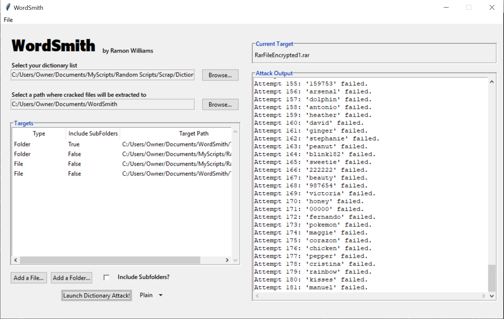
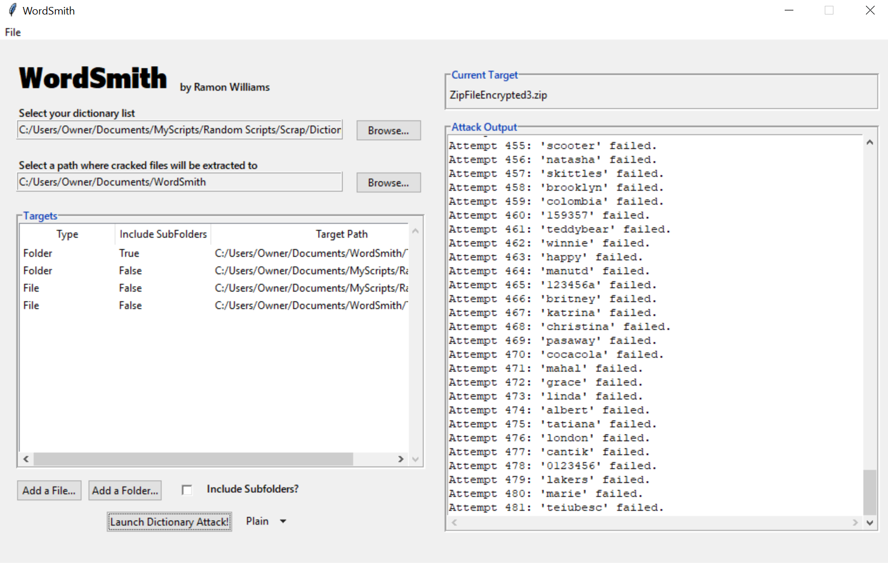

[![Forks][forks-shield]][forks-url]
[![Stargazers][stars-shield]][stars-url]
[![Issues][issues-shield]][issues-url]
[![MIT License][license-shield]][license-url]

# WordSmith (Password Cracking Tool)

A password cracking tool written in Python's standard GUI package, Tkinter.

# Table of Contents
- [Introduction](https://github.com/RamonWill/WordSmith#Introduction)
- [Installation](https://github.com/RamonWill/WordSmith#Installation)
- [Features](https://github.com/RamonWill/WordSmith#Features)
- [Credits](https://github.com/RamonWill/WordSmith#Credits)
- [Video Demo](https://github.com/RamonWill/WordSmith#Video-Demo)
- [Screenshots](https://github.com/RamonWill/WordSmith#Screenshots)

# Introduction
This software is not to be used for malicious purposes.
I made this for educational purposes and to improve my experience with the Python Standard Library.

# Installation
If you do not have Python 3.7+, you can download it [here](https://www.python.org/downloads/release/python-370/, "here").
In the terminal navigate to the project directory and type `pip3 install -r requirements.txt`.
This will install the dependencies of the program. Once the program is installed you can run the program directly from WordSmith.py

# Features
* Supports password cracking on .zip and .rar files.
* Users can choose to crack files individually or crack folders with the optional choice of cracking the folder's subfolders.

WordSmith will traverse through the files of a folder and determine whether they are password protected or not. In the event that they are password protected it will then attempt to crack the files using a provided dictionary list. Lastly, WordSmith will stored all extracted files to a provided path and it will store a text document that contains password/user pairs

# Credits
I'd like to thank the contributors to stack overflow and the python standard library.

# Video Demo

# Screenshots

[forks-shield]: https://img.shields.io/github/forks/RamonWill/WordSmith.svg?style=for-the-badge
[forks-url]: https://github.com/RamonWill/WordSmith/network/members
[stars-shield]: https://img.shields.io/github/stars/RamonWill/WordSmith.svg?style=for-the-badge
[stars-url]: https://github.com/RamonWill/WordSmith/stargazers
[issues-shield]: https://img.shields.io/github/issues/RamonWill/WordSmith.svg?style=for-the-badge
[issues-url]: https://github.com/RamonWill/WordSmith/issues
[license-shield]: https://img.shields.io/github/license/RamonWill/WordSmith.svg?style=for-the-badge
[license-url]: https://github.com/RamonWill/WordSmith/blob/master/LICENSE.txt
